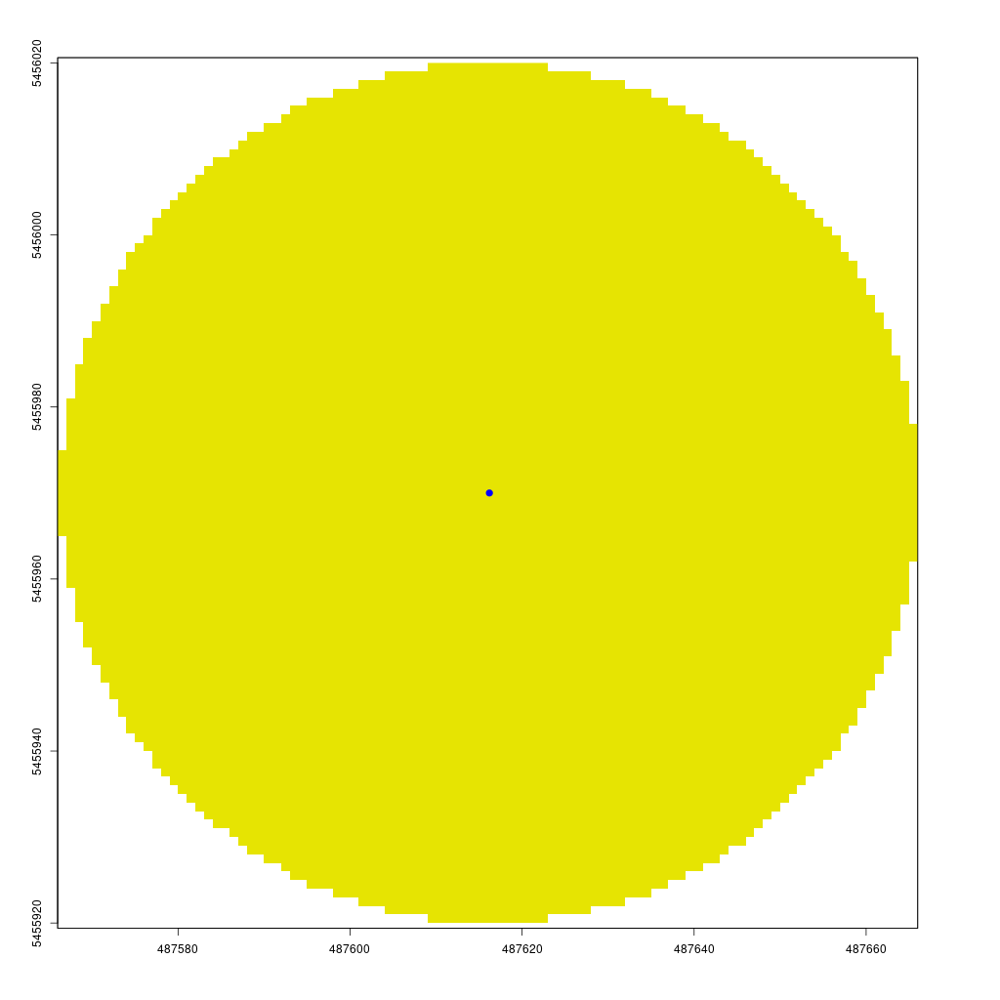
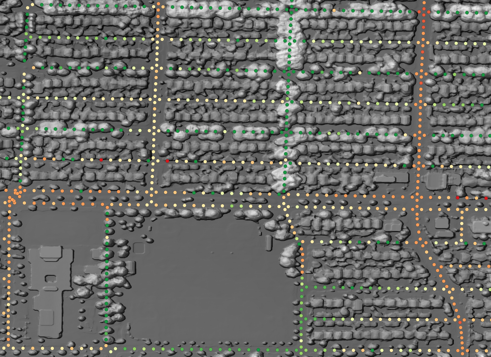

```{=html}
<style>
body {text-align: justify}
</style>
```

```{r setup, include=FALSE}
knitr::opts_chunk$set(echo = TRUE)
```

Exposure to residential greenness—such as parks, gardens, or other vegetated areas—has been linked to various health benefits, ranging from improved mental well-being to reduced chronic disease risk [@markevych2017; @labib2020]. Throughout this post, the terms greenness and greenspace will be used interchangeably. Greenspace exposure is commonly categorized into three types:

  - **Availability**: The physical amount of greenspace
  - **Accessibility**: The spatial proximity to greenspace
  - **Visibility**: The visual perception of greenness [@labib2020]

In our recent [publication](https://doi.org/10.1007/s11524-022-00630-w), we evaluated the *availability* of greenness via remote sensing–derived [NDVI](https://eos.com/ndvi/) from a top-down (bird's-eye) view, and further integrated a distance-weighted road network to assess *accessibility* around participants’ residences. The next logical step is to incorporate *visibility*, capturing how much greenery is actually seen within a person’s surroundings.

This post demonstrates how to download and prepare all necessary files for a viewshed-based visibility analysis. In the first section, I cover data acquisition and processing; in the second, I explain the main functions used for the analysis. My implementation is both lightweight and fast, maintaining high spatial resolution. Additionally, I showcase how these methods can be used to compute a Viewshed Greenness Visibility Index (VGVI), which is available in my [CGEI](https://github.com/STBrinkmann/CGEI) R package.

## Libraries

First, load all packages. If one of these packages is not installed, use the `install.packages()` function.
```{r message=FALSE, warning=FALSE}
library(dplyr)
library(sf)
library(ggplot2)
library(ggthemes)
library(terra)
library(lidR)
library(future)
library(data.table)
```

## Data

The data is being provided online at [Zenodo](https://zenodo.org/records/5061257).

```{r}
dsm <- rast("https://zenodo.org/records/5061257/files/Vancouver_DSM_1m.tif")
dtm <- rast("https://zenodo.org/records/5061257/files/Vancouver_DTM_1m.tif")
```

## Visibility Analysis

Greenspace is associated with multiple health benefits through a variety of pathways [@markevych2017; @dzhambov2020; @labib2020]. In a recent study (in submission), we analyzed health benefits based on the availability and accessibility of greenspace using a top-down, bird's-eye approach. Visibility constitutes a third type of exposure assessment and represents the amount of greenspace observable from a given point [@labib2020]. While recent studies have adopted viewshed-based visibility analysis [@chamberlain2013; @tabrizian2020; @labib2021], visibility measures are still underrepresented in current research [@labib2020]. The code below is primarily based on the methods described by @labib2021 and their Python implementation of the [Green Visibility Index](https://github.com/jonnyhuck/green-visibility-index/blob/master/gvi.py). The overall process is illustrated in the figure below.

[{width="7.13in"}](https://doi.org/10.1016/j.scitotenv.2020.143050)

~*Conceptual\ design\ of\ greenspace\ visibility\ modelling\ [@labib2021].*~

A line of sight is calculated from the observer to every point in the area of interest, determining which points are visible versus those that are hidden. To distinguish green from non-green points, a greenspace mask is applied. For simplicity in this post, the code is not fully optimized. A more optimized approach is available in my [CGEI](https://github.com/STBrinkmann/CGEI) R package, which employs improved data structures and C++.

### Rasterprofile

To determine the visibility of point B from point A, we first need to retrieve all raster cells between these two points. The `rasterprofile` function returns a `matrix` with the X- and Y-coordinates, height, and cell number for every cell along the line from A to B. Surprisingly, `raster::extract` is faster than `terra::extract` when used with a matrix.

```{r eval=FALSE}
rasterprofile <- function(r, x0, y0, x1, y1, resolution){
  # Sample a raster along a straight line between two points
  # Try to match the sampling size to the raster resolution
  dx = sqrt((x0 - x1)^2 + (y0 - y1)^2)
  nsteps = 1 + round(dx / resolution)
  pointsZ <- cbind(x0 + (0:nsteps) * (x1 - x0) / nsteps, 
                   y0 + (0:nsteps) * (y1 - y0) / nsteps)
  
  rasterVals <- raster::extract(x = r, y = pointsZ, cellnumber = TRUE)
  
  pointsZ <- cbind(pointsZ, rasterVals[,2], rasterVals[,1])
  
  if (anyNA(pointsZ)) {
    pointsZ <- pointsZ[stats::complete.cases(pointsZ),,drop = FALSE]
  }
  return(pointsZ)
}
```

### Line of Sight

An observer at point A can see point B only if no object in between blocks the view. The `lineOfSight` function evaluates visibility for every raster cell between A and B. It calculates the tangent *⍺* on the change in height *𝚫height* (opposite side) and *distance traveled* (adjacent side) for each step. A point is visible if its tangent *⍺* is greater than the maximum tangent observed so far.

n R, this would require a for-loop to compare each point’s tangent to the maximum tangent seen so far, thus preventing vectorization. Native R code can be slow for these tasks, so I implemented the step in C++ using the [Rcpp](http://www.rcpp.org/) package.

```{Rcpp eval=FALSE}
#include <Rcpp.h>
using namespace Rcpp;

// [[Rcpp::export]]
NumericVector isVisibleC(NumericVector x) {
  int n = x.size();
  NumericVector out(n);
  out[0] = 1;
  
  double max_tangent = -9999;
  
  for(int i = 1; i < n; ++i) {
    double this_tangent = x[i];
    
    if (this_tangent > max_tangent) {
      max_tangent = this_tangent;
      out[i] = 1;
    } else {
      out[i] = 0;
    }
  }
  return out;
}
```

The `lineOfSight` function returns a `data.table` with the cell number and corresponding visibility status for every point between A and B. Visible cells are marked with 1 and non-visible cells with 0.

```{r eval=FALSE}
lineOfSight <- function(xy1, x0, y0, height0, resolution, dsm_data) {
  # Get start XY from input
  x1 <- xy1[1]
  y1 <- xy1[2]
  
  # Get the pixels in the line
  pixels <- rasterprofile(r = dsm_data, x0 = x0, y0 = y0, x1 = x1, y1 = y1, 
                          resolution = resolution)
  
  # Distance traveled so far
  distance_traveled = sqrt((y0 - pixels[,2])^2 + (x0 - pixels[,1])^2)
    
  # Calculate tangent from delta height (opposite side) and distance traveled (adjacent side)
  tangents <- (pixels[,3] - height0) / (distance_traveled * resolution)
  
  # Is visible? Current tangent must be greater than max. tangent
  visibility <- isVisibleC(tangents)
  
  # Return cellnumber and visibility-value
  data.table::as.data.table(cbind(pixels[,4], visibility))
}
```

### Viewshed

Finally, we can calculate the visibility of all points within a specified buffer around point *A* using `lineOfSight` function. The `viewshed` function creates a circular raster (the start point plus a `max_distance` buffer) where 1 indicates visible points and 0 indicates non-visible points. To do this efficiently, we only need to compute the line of sight from the center to each boundary point of the circle, storing visibility information for intermediate cells along the way.
The animation below demonstrates how the `viewshed` function operates. We start with a raster of unknown visibility (yellow), then iteratively call `lineOfSight` to mark cells as visible (green) or non-visible (white).

```{r fig.height=5, fig.width=5, echo=FALSE}
 
```

As noted earlier, I have already implemented the `viewshed` function in my `CGEI` R package. 

### Examples

We first create a starting point to see how different resolutions affect visibility.

```{r}
# Disable progress bar for terra::aggregate
terra::terraOptions(progress = 0)

sf_start <- sfheaders::sf_point(c(487616.2, 5455970)) %>% 
    st_sf(crs = st_crs(26910))
```

#### 1. Resolution = 1m

Output-Raster-Cells: 360 000\
Runtime: 124.3 milliseconds\
Total visibility: 9.1%

```{r fig.height=9, fig.width=16}
viewshed_1 <- CGEI::viewshed_list(observer = sf_start,
                                  dsm_rast = dsm, 
                                  dtm_rast = dtm, 
                                  max_distance = 300, 
                                  observer_height = 1.8)
plot(viewshed_1[[1]])
```

#### 3. Resolution = 2m

Output-Raster-Cells: 90 000\
Runtime: 27.12 milliseconds\
Total visibility: 11.5%

```{r fig.height=9, fig.width=16}
viewshed_2 <- CGEI::viewshed_list(observer = sf_start,
                                  dsm_rast = aggregate(dsm, 2), 
                                  dtm_rast = aggregate(dtm, 2), 
                                  max_distance = 300, 
                                  observer_height = 1.8)
plot(viewshed_2[[1]])
```

#### 4. Resolution = 5m

Output-Raster-Cells: 14 400\
Runtime: 9.21 milliseconds\
Total visibility: 14.6%

```{r fig.height=9, fig.width=16}
viewshed_3 <- CGEI::viewshed_list(observer = sf_start,
                                  dsm_rast = aggregate(dsm, 5), 
                                  dtm_rast = aggregate(dtm, 5), 
                                  max_distance = 300, 
                                  observer_height = 1.8)
plot(viewshed_3[[1]])
```

## Network Visible Greenspace

A practical use case for the viewshed algorithm is to calculate the visible greenness in a person’s neighborhood by examining visibility along roads and paths.

### Greenspace Mask

To determine how much of the visible area is green, we need a vegetation mask that differentiates green from non-green pixels. For this example, we use the [Vancouver Land Cover Classification 2014 - 2m LiDAR (Raster)](http://www.metrovancouver.org/data/Data/LandCoverClassification-2m/LCC2014_2m_LiDAR_gdb.zip). After opening the dataset in ArcGIS and exporting it as a TIFF, the class values can be read from the documentation.

```{r echo=FALSE, message=FALSE, warning=FALSE}
library(kableExtra)
dplyr::tibble(
    Value = 1:14,
    "Level 1" = c(
      "Built-up", "", "", "Bare", "", "Vegetation", 
      "", "", "", "", "", "Water", "Shadow", "Clouds/Ice"
    ),
    "Level 2"  = c(
      "Buildings", "Paved", "Other Built", "Barren", "Soil", "Tree canopy", 
      "", "", "Grass-herb", "", "Non-photosynthetic vegetation", "", "", ""
    ),
    "Level 3" = c(
      "", "", "", "", "", 
      "Coniferous", "Deciduous", "Shrub", 
      "Modified Grass-herb", "Natural Grass-herb", "", "", "", ""
    ),
    "Criteria" = c(
      "Identified using shape/size, shadow cast, height, relative canopy height, texture.",
      "Everything from sidewalks and alleys to highways.",
      "Not concrete/asphalt built surfaces or building roofs. Sports surfaces (artificial turf and running tacks), possibly transit or rail areas, other impervious surfaces, etc.",
      "Beaches, alpine rock, shoreline rock, etc. Lack of vegetation. Likely not soil (colour/context suggests no organic matter and/or imperviousness). Also quarries, gravel pits, dirt roads.",
      "Agricultural soils (could be light or dark), cleared/open areas where darker colours indicate organic matter present (as compared to, e.g. sand), potentially riverine/alluvial deposits.",
      "Predominantly coniferous (>75%)",
      "Predominantly deciduous (>75%)",
      "Woody, leafy, and generally rough-textured vegetation shorter than trees (approx. <3-4m), taller than grass.",
      "Crops, golf course greens, city park grass, lawns, etc.",
      "Alpine meadows, near-shore grass areas, bog/wetland areas.",
      "Dead grass, drought stressed vegetation, could include log",
      "Lakes, rivers, inlets, irrigation channels, retention ponds, pools, etc.",
      "Dark pixels with v/ low reflectance values. Image features not easily visible. Compare w/ RapidEye image for shadow",
      "Very bright pixels, that are not high-reflectance features from built-up areas."
    )
) %>% kbl(escape = FALSE, align=c("l", "c", "c", "c", "l"),
          table.attr = "style='width:90%;'") %>% 
  kable_classic("striped", full_width = F) %>%
  row_spec(0, bold = T)
```

For demonstration purposes, we will treat all vegetation classes as green.

```{r fig.height=9, fig.width=16}
# Load LandCover
landCover <- rast("https://zenodo.org/records/5061257/files/Vancouver_LULC_2m.tif")

# Select Vegetation
greenspace <- landCover %in% c(6:10); invisible(gc())

# Plot to compare LandCover and vegetation mask
par(mfrow = c(1,2))
landCover %>% 
  crop(st_buffer(sf_start, 300)) %>% 
  plot(legend = FALSE)

points(st_coordinates(sf_start)[1], st_coordinates(sf_start)[2], 
       col = "blue", cex = 3, pch = 20)

greenspace %>% 
  crop(st_buffer(sf_start, 300)) %>% 
  plot(legend = FALSE)

points(st_coordinates(sf_start)[1], st_coordinates(sf_start)[2], 
       col = "blue", cex = 3, pch = 20)
```

### Viewshed Greenness Visibility Index

The VGVI (Viewshed Greenness Visibility Index; [@labib2021]) represents the proportion of visible greenspace to the total visible area. Its values range from 0 to 1, where 0 = no visible greenspace and 1 = all visible cells are green. Applying the `vgvi` function below to `viewshed_1` returns 0.91, meaning 91% of the visible area is vegetated.\
In @labib2021, the authors applied a distance-decay function to account for the decreasing visual prominence of an object with increasing distance from the observer. I will address distance-decay models in a future post.

```{r}
vgvi <- function(viewshed, greenspace) {
  # Get XY coordinates that are visible
  xy <- viewshed %>% 
    terra::xyFromCell(which(viewshed[] == 1))

  # Intersect XY with greenspace mask
  output <- greenspace[terra::cellFromXY(greenspace, xy)] %>% 
    unlist(use.names = FALSE)

  # Proportion of visible green
  return(sum(output == 1) / length(output))
}
```

### Network Analysis

We can also leverage the  `DRIGLUCoSE` R package from our recent publication to calculate a road network and then assess visible greenspace along it. For more details on `DRIGLUCoSE`, refer to the [GitHub repository](https://github.com/STBrinkmann/DRIGLUCoSE).

```{r message=FALSE, warning=FALSE}
# Download and process road network from OSM data
aoi.osm <- DRIGLUCoSE::osm_roads(x = sf_start, dist = 10, speed = 75)

# Calculate isodistances
aoi.isodistances <- DRIGLUCoSE::isodistances(x = sf_start %>% mutate(tag = 1),
                                             tag = "tag", road_network = aoi.osm, 
                                             speed = 75, 
                                             isochrones_seq = seq(1, 10, 1))
```

The figure below shows the isodistances with the red dot indicating the starting point. We will calculate the proportion of visible greenspace every 10 meters.

```{r echo=FALSE, fig.height=7, fig.width=10, message=FALSE, warning=FALSE, dev='svg'}
aoi.isodistances %>%
  dplyr::mutate(time = as.integer(time)) %>% 
  tmap::tm_shape() +
  tmap::tm_lines(col = "time", lwd = 3, #style = "cont",
                 palette = "-viridis", n = 10,
                 title.col = "Walking-Distance\n(minutes)",
                 legend.col.is.portrait = T) +
  tmap::tm_shape(sf_start) + 
  tmap::tm_dots(col = "red", size = 0.9, shape = 20) +
  tmap::tm_layout(legend.outside.position = "right",
                  legend.position = c(-0.248, 0.6),
                  legend.outside.size = .15,
                  legend.title.size = 1.5,
                  legend.text.size = 1,
                  panel.show = F)
```

To evaluate network visibility, we use the `vgvi` function from the `CGEI` package to calculate the VGVI along the road network. In this example, we sample points every 5 meters along the isodistances. A 2m resolution would be sufficient for a larger study because it does not differ much from 1m in practice—but here the total runtime at 1m resolution is still acceptable (only 4 seconds using 22 cores).
```{r}
output <- CGEI::vgvi(observer = aoi.isodistances, 
                     dsm_rast = dsm,
                     dtm_rast = dtm, 
                     greenspace_rast = greenspace, 
                     max_distance = 300, 
                     observer_height = 1.8,
                     spacing = 5,
                     cores = 22)
```

### Results

The results of the VGVI appear in the figure below.
```{r fig.height=7, fig.width=10, message=FALSE, warning=FALSE, dev='svg'}
output %>% 
  tmap::tm_shape() +
  tmap::tm_dots(col = "VGVI", shape = 20, size = 0.25,
                palette = "RdYlGn", n = 10,
                title = "Visible Greenspace") +
  tmap::tm_layout(legend.outside.position = "right",
                  legend.position = c(-0.25, 0.62),
                  legend.outside.size = .15,
                  legend.title.size = 1.35,
                  legend.text.size = 1,
                  panel.show = F,
                  frame = FALSE)
```

To determine the mean VGVI for the observer in the center, we simply take the average of all measurements. More sophisticated approaches might apply linear or logistic weighting to account for distance, as shown in our recent publication.

```{r}
round(mean(output$VGVI), 2)
```

A mean value of 0.47 indicates that 47% of the visible area along the network is vegetated.

One notable limitation of the viewshed algorithm is its inability to accurately account for eye-level visibility when the observer is under a tree. This is because the LiDAR-derived DSM blocks all lines of sight under the canopy.

```{r echo = FALSE, fig.height=3, fig.width=5, message=FALSE, warning=FALSE, dev='svg'}
output %>% 
  ggplot(aes(x = VGVI)) + 
  geom_histogram(bins = 10) + 
  theme_light()
```

In the histogram above, many points have a GVI of 1. I have plotted the DSM and the GVI points along the route network in QGIS.{width="7.13in"}

The image shows that these green points are located underneath trees, so no lines of sight extend beyond the canopy. As a result, all visible cells are green, leading to a GVI of 1.

Although we can incorporate a distance-decay function or measure *actual* activity space rather than *potential* activity space, these are topics for future posts. Regardless, there is a clear variation in GVI values indicating areas with higher versus lower visible greenness.

## Conclusion

In summary, this post demonstrates a fast, lightweight, and parallelizable approach to measuring greenspace visibility using open-source R packages. By comparing resolutions from 1m to 5m, we found that 2m provides a practical balance between accuracy and speed, making large-scale applications feasible. However, the method cannot fully capture eye-level views under tree canopies, a challenge that underscores the need for more sophisticated modeling and sensor data. Despite this limitation, viewshed-based exposure assessments can add a valuable visual dimension to health geography studies, complementing traditional availability and accessibility measures of greenspace. Future work may explore integrating actual GPS-tracked routes and distance-decay functions, allowing for more nuanced activity-space models. We encourage researchers and urban planners to adopt and refine these methods, helping to deepen our collective understanding of how visible greenery influences wellbeing.

## References
