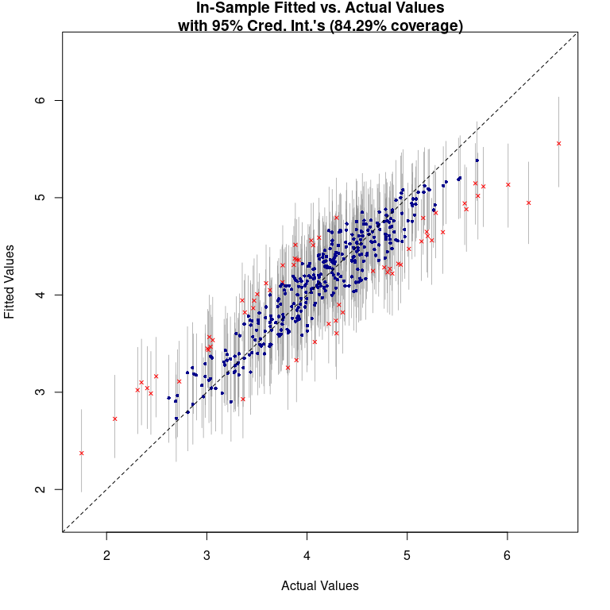

```{=html}
<style>
body {
text-align: justify}
</style>
```
In our [recent publication from 2020](https://geobrinkmann.com/publication/scarpone2020/), we analyzed COVID-19 incidence and socioeconomic, infrastructural, and built environment characteristics using a multimethod approach. Germany has 401 counties, which vary greatly in size. Counties in Southern Germany are generally smaller and have higher population densities. The figure below shows the natural log-transformed, age-adjusted COVID-19 incidence rates as of April 1, 2020, highlighting spatial differences between the northeast and the south-southwest.
{width="60%"}

After conducting a thorough spatial exploratory analysis, we applied a *Bayesian Additive Regression Trees* (BART; [@Chipman2010]) model to identify socioeconomic and built environment covariates associated with COVID-19 incidence. BART is an ensemble-of-trees method, similar to random forests [@breiman2001] and stochastic gradient boosting [@friedman2002]. *Tree-based regression models* are flexible enough to capture interactions and non-linearities. Summation-of-trees models (such as BART or random forests) can capture even more complex relationships than single-tree models. However, BART differs from these common algorithms because it uses an underlying *Bayesian probability* model rather than a purely algorithmic approach [@kapelner2016]. One key advantage of the Bayesian framework is that it computes posterior distributions to approximate the model parameters. These priors help prevent any single regression tree from dominating the ensemble, thus lowering the risk of overfitting [@kapelner2016; @scarpone2020].

For our analysis, we used the R package `bartMachine` [@kapelner2016]. One caveat is that `bartMachine` does not support *tibble* objects as input features, but aside from that it is intuitive and simple to use.\
In this post, I will illustrate how we used the same data from our COVID-19 paper to analyze age-adjusted incidence rates in German counties using BART. Even though the BART model has strong predictive capabilities, we will *not* use it to forecast new COVID-19 cases. Instead, we will use it as an exploratory tool to understand which factors influence the spread of COVID-19 and how they interact with incidence rates.

I want to emphasize that we are only examining data from a single date, April 1, 2020, covering the first wave of the pandemic in Germany. A friend of mine is currently investigating which factors contributed to the second and third waves. Although some variables remain important across different time points, others gain or lose relevance, and in some cases the direction of their effects appears reversed.

In sum, BART is used here as an exploratory tool, and we will generate *Partial Dependence Plots (PDPs)* to visualize and interpret the marginal effects of key predictors.

If you are interested in more detail about pre-modeling exploratory data analysis or data engineering, please see the [paper](https://geobrinkmann.com/publication/scarpone2020/) or [contact me](https://geobrinkmann.com/#contact).

## Data download and pre-processing

First, we need to load the packages and set the memory size and number of cores for `bartMachine`.
```{r message=FALSE, warning=FALSE}
# Set to use 45 GB memory - adjust this to your resources
options(java.parameters = "-Xmx45g")

# Load packages
library(bartMachine)
library(dplyr)

# Set to run on 20 threads - adjust this to your resources
set_bart_machine_num_cores(20)
```

*Tip:* Double-check that the correct amount of RAM is being allocated after loading `bartMachine.` If the message shows a different number, try manually typing out the `java.parameters` string instead of copy-pasting.

Next, we download the data and normalize the church density variable (`Rch_den`).e.

```{r}
# Function for linear stretching. New range: 0-1
range0_1 <- function(x){(x-min(x))/(max(x)-min(x))}

# Download data
data <- read.csv("https://github.com/CHEST-Lab/BART_Covid-19/raw/master/Data/GermanyTraining.csv",
                 stringsAsFactors = F) %>%
  mutate(Rch_den = range0_1(Rch_den),
         NUTS2_Fact = as.factor(NUTS2_Fact), 
         BL_ID = as.factor(BL),
         S_109 = as.factor(S_109))

# Select variables: Lat/ Long, BL, NUTS2, socioeconomic, build environment and age adjusted case rate
data <- data[c(374, 3, 4, 5, 38, 28, 65:372)]
```

```{r echo=FALSE, message=FALSE, warning=FALSE}
library(kableExtra)
data %>% as_tibble() %>% 
  head() %>% 
  kbl(escape = FALSE, table.attr = "style='width:90%;'", digits = 2) %>% 
  kable_classic("striped", full_width = F) %>%
  row_spec(0, bold = TRUE)
```

The first column (`AdjRate`) contains age-adjusted incidence rates. The `X` and `Y` columns represent longitude and latitude. `NUTS2_Fact` represents government regions (Regierungsbezirke), `BL_ID` is the federal state (Bundesland), and `EWZ` is the population. The remaining columns cover socioeconomic, infrastructural, and built environment features. We will filter out only the most relevant features later.

BART requires a *data.frame* of predictors and a separate vector for the response variable:

```{r}
psych::skew(data$AdjRate)

# Response variable
y <- log(data$AdjRate)

# Data.frame of predictors
data_bm <- select(data, -c(AdjRate))
```

Because `AdjRate` is highly skewed (skewness = 3.64), we apply a log transformation. Though BART is non-parametric and can handle skewed data, transforming the response variable aids in visually interpreting results.

Below is a summary of the log-transformed `AdjRate`:

```{r echo=FALSE, message=FALSE, warning=FALSE}
tibble(
  Mean = mean(y),
  SD = sd(y),
  Min = min(y),
  Max = max(y)) %>% 
  kbl(escape = FALSE, digits = 2) %>% 
  kable_classic("striped", full_width = FALSE) %>%
  row_spec(0, bold = TRUE)
```

## First BART model

We can use default hyperparameter values for BART, but `bartMachine` offers a convenient tuning function called `bartMachineCV` to find optimal values. Because that process can be time-consuming, I've omitted it here. Below, I simply build a BART model using those *pre-determined* optimal hyperparameters.

```{r}
bm_All <- bartMachine(X = data_bm, y = y, 
                      k=2, nu=3, q=0.9, num_trees=100, 
                      num_iterations_after_burn_in=2000, 
                      num_burn_in = 300, 
                      seed = 1234, verbose = FALSE)

summary(bm_All)
```

The Pseudo-R² of `r round(bm_All$PseudoRsq, 2)` and RMSE of `r round(bm_All$rmse_train, 2)` look promising. Let’s check the error assumptions next:

```{r eval=FALSE, fig.width=8, fig.height=8}
check_bart_error_assumptions(bm_All)
```


Both diagnostic plots look reasonable. In the second one (Assessment of Heteroskedasticity), there is a mild pattern, but not a stark one. Overall, the model seems to fit well, though it might struggle slightly with extreme values.

```{r eval=FALSE, fig.width=8, fig.height=8}
plot_y_vs_yhat(bm_All, credible_intervals = TRUE)
```


The "Fitted vs. Actual Values" plot also demonstrates good model performance. Again, we see that the model tends to *over-predict* extremely low values and *under-predict* extremely high values. We could also map the residuals to check for spatial clustering, but let’s first reduce the model’s complexity by removing non-important predictors.

## Variable Selection

Although BART yields *excellent* R² values, part of its power lies in its ability to handle high-dimensional data. In large datasets, often only a fraction of the predictors significantly influence the response variable. *Occam's razor* suggests favoring simpler models over overly complex ones.

The function `var_selection_by_permute` (introduced by [@bleich2014]) helps reduce model complexity. Feel free to skip the following code and just trust my results—this step can be time-consuming:

```{r eval=FALSE}
# Leave the num_trees_for_permute small, to force variables to compete for entry into the model!
var_sel <- bartMachine::var_selection_by_permute_cv(bm_All, num_trees_for_permute = 20)

# Look at the most important variables
var_sel$important_vars_cv
```

```{r echo=FALSE}
c("BL_ID_Baden-Württemberg", "BL_ID_Bayern", "BL_ID_Hessen", "ff_pop", "hair_pp", "thea_pp", "NUTS2_Fact_11", "NUTS2_Fact_27", "NUTS2_Fact_40", "NUTS2_Fact_71", "S_170", "play_dn", "bir_km2", "cc_pop", "sch_den", "kid_den", "Rch_den", "S_109_2", "EWZ", "Pop_Den", "S_004", "S_006", "S_020", "S_051", "S_054", "S_066", "S_070", "S_080", "S_104", "S_107", "S_115", "S_123", "S_130", "S_146", "S_153", "X", "Y")
```

Below is the subset of important variables (grouped thematically). I also removed *NUTS2_Fact* and *BL_ID*:

```{r}
data_subset <- data_bm %>%
  select(c(
    # Geographical Units
    X, #Longitude
    Y, #Latitude
    
    # Political units
    S_109, #Rural/Urban
    
    # Socioeconomic
    EWZ, #Population
    Pop_Den, #Population density
    S_004, #Unemployment rate under 25
    S_006, #Household income per capita 
    S_020, #Employment rate 15-<30
    S_051, #Voter participation
    S_054, #Apprenticeship positions
    S_066, #Household income
    S_070, #Deptors rate
    S_080, #Recreationl Space
    S_104, #Income tax
    S_107, #Steuerkraft
    S_115, #Regional population potential
    S_123, #Child poverty
    S_130, #IC train station access
    S_146, #Commuters >150km
    S_153, #Foreign guests in tourist establishments
    S_170, #Longterm unemployment rate
    
    # Built environment
    Rch_den, #Church density
    play_dn, #Playground density
    bir_km2, #Biergarten per km²
    ff_pop, #Fast food places per capita
    hair_pp, #Hairdresser per capita
    thea_pp, #Theatre per capita
    cc_pop, #Community centre density
    sch_den, #School density
    kid_den #Kindergarten density
  ))
```

## Second BART model

With this subset of key predictors, I now build a new BART model (again using *pre-determined* optimal hyperparameters):

```{r}
bm_final <- bartMachine(X = data_subset, y = y, 
                        k=3, nu=3, q=0.99, num_trees=225,
                        seed = 1234, verbose = FALSE)
summary(bm_final)
```

Compared to the first model, the Pseudo-R² decreases from `r round(bm_All$PseudoRsq, 2)` to `r round(bm_final$PseudoRsq, 2)`, equating to a `r round((bm_All$PseudoRsq - bm_final$PseudoRsq) / bm_All$PseudoRsq * 100)`% reduction in explained variance. The RMSE increased from `r round(bm_All$rmse_train, 2)` to `r round(bm_final$rmse_train, 2)`, indicating that the final model predicts the age-adjusted incidence rate of COVID-19 with an accuracy of roughly +/− `r round(exp(bm_final$rmse_train), 1)` cases per 100,000. Let’s again check the diagnostic plots:

```{r eval=FALSE, fig.width=8, fig.height=8}
check_bart_error_assumptions(bm_final)
```

 The new model’s Q-Q and residuals plots look fine, but as expected, it performs slightly worse on extreme values.

```{r eval=FALSE, fig.width=8, fig.height=8}
plot_y_vs_yhat(bm_final, credible_intervals = TRUE)
```



The "Fitted vs. Actual Values" plot shows *okay* performance, though more points lie outside the confidence intervals. Next, let’s map the residuals to check for any spatial clustering.

## Spatial autocorrelation

We can quickly visualize residuals by linking them to a shapefile of German counties (*NUTS3*). Any obvious clustering of positive or negative residuals would indicate spatial autocorrelation.

```{r fig.height=7, fig.width=7, message=FALSE, warning=FALSE}
library(sf)
library(RColorBrewer)
library(tmap)

# Download shapefile
shp <- read_sf("https://github.com/STBrinkmann/data/raw/main/RKI_sf.gpkg")

# Sort shapefile, that it has the same order as the data_subset
shp <- shp[order(match(shp$EWZ, data_subset$EWZ)),]

# Join residuals to shapefile, then map residuals
shp$resid <- bm_final$residuals
tm_shape(shp) + 
  tm_polygons(col="resid", 
              title="BART Machine Residuals\n(log incidence rate)", 
              breaks=seq(-1.75, 1.75, 0.5), midpoint=NA, palette="RdBu") + 
  tm_layout(frame = FALSE,
            inner.margins=c(0.02, 0.02, 0.02, 0.20),
            legend.position = c(0.7, 0.22),
            legend.frame = TRUE,
            legend.outside = FALSE, 
            bg.color = "white")
```

No clear geographical pattern emerges, suggesting no strong spatial clusters. For a formal test, we can compute *Moran’s I*. I will not explain Moran's I in this post, but I would highly recommend these posts: [Intro to GIS and Spatial Analysis](https://mgimond.github.io/Spatial/spatial-autocorrelation-in-r.html#app8_3) and [Spatial autocorrelation analysis in R](https://rpubs.com/quarcs-lab/spatial-autocorrelation).

```{r message=FALSE, warning=FALSE}
library(spdep)
# Define neighboring polygons
nb <- poly2nb(shp, queen=TRUE)

# Assign weights to each neighboring polygon
lw <- nb2listw(nb, style="B", zero.policy=TRUE)

# Compute Moran's I statistic using a Monte-Carlo simulation 
MC <- moran.mc(shp$resid, lw, nsim=99)
MC
```

Moran’s I ranges from -1 to 1, where values closer to ±1 indicate strong positive/negative spatial autocorrelation, and 0 implies randomness. With a Moran’s I of `r round(MC$statistic, 2)` (p=`r round(MC$p.value, 2)`), we conclude there is no significant spatial autocorrelation in the residuals.

## Partial Dependence Plots

So far, we’ve built and refined a BART model to predict age-adjusted incidence rates of COVID-19 in German counties. However, our main goal is to explore the data rather than simply predict. BART’s high R² suggests it captures these non-linear relationships, and Partial Dependence Plots (PDPs) let us visualize and interpret them [@friedman2002; @scarpone2017; @scarpone2020].

Although the [pdp](https://cran.r-project.org/web/packages/pdp/index.html) is great for computing PDPs, it does not directly support `bartMachine`. Fortunately, `bartMachine` provides its own PDP function, `pd_plot`. Below is a demonstration using `S_115` (Regional Population Potential):

```{r fig.height=8, fig.width=8, message=FALSE, warning=FALSE}
# Set parameters to plot PDP top and histogram bottom
par(mfrow = c(2,1))

pd_plot(bm_final, "S_115", levs = c(0.0, seq(0, 1, 0.1), 1))
hist(bm_final$X$S_115, 20, 
     main = "Histogram of the Regional Population Potential",
     xlab = "Regional Population Potential")
```

*Regional population potential* measures the likelihood of direct human interactions in a region. This PDP suggests minimal marginal change in incidence at the lower end of the distribution, implying less chance of viral contagion in areas with fewer human interactions. The curve rises notably between the 20th and 80th percentiles (14,016 to 47,067), indicating a strong non-linear effect on incidence rates.

To log-transform the x-axis for clarity, you would need a custom PDP function, since `pd_plot` does not support that directly. I wrote a variant that returns ggplot2 objects [GitHub](https://github.com/CHEST-Lab/BART_Covid-19/blob/master/pdPlotGG.R)), which lets you customize plots extensively.

Below is a *multi-panel* PDP from our publication, showing the top 10 variables. You can see more details and interpretation of these variables [here](https://ij-healthgeographics.biomedcentral.com/articles/10.1186/s12942-020-00225-1#Sec18).

[](https://ij-healthgeographics.biomedcentral.com/articles/10.1186/s12942-020-00225-1/figures/6)

## Conclusion

In this post, we developed and refined a BART-based workflow for modeling age-adjusted COVID-19 incidence rates across German counties. We started by applying BART to a high-dimensional dataset of socioeconomic, infrastructural, and built environment predictors, then used a permutation-based variable selection technique to isolate the most important features. Although BART can handle dozens or even hundreds of predictors, our results showed that only a smaller subset of variables drove most of the explanatory power.  

By visualizing these relationships with Partial Dependence Plots, we uncovered non-linear effects and interactions that more conventional methods might have missed. These plots also help “open the black box,” translating an otherwise opaque machine learning model into actionable insights. Although BART performed well overall, we observed that it tended to under-predict very high values and over-predict very low ones, highlighting the challenges of modeling extreme outcomes.  

In future posts, I will focus on **out-of-sample validation** to confirm the model’s robustness and detect any lingering overfitting issues. I also plan to dive deeper into how the variable selection procedure can be tuned for different research contexts. Ultimately, BART’s Bayesian foundation—combined with flexible tree-ensemble strategies—offers a compelling toolkit for complex, spatially heterogeneous data like COVID-19 incidence.

## References
